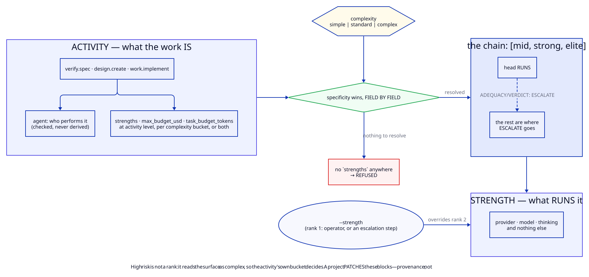

# Agents, activities and strengths

Three concepts, each owning one fact. Nothing keys off a list of agent names, because a name
list goes stale the first time an agent changes shape.

| | is | answers |
|---|---|---|
| an **agent** | *who* does the work — a definition with tools, isolation and doctrine | what it is capable of |
| an **activity** | *what* the work is — a named unit of dispatched work | what it may spend, and what runs it |
| a **strength** | *what runs it* — a named model configuration | provider, model, thinking |



## Strengths — the model axis, and nothing else

```yaml
strengths:
  mid:    {provider: anthropic, model: claude-sonnet-5,   thinking: high}
  strong: {provider: anthropic, model: claude-opus-5[1m], thinking: xhigh}
  elite:  {provider: anthropic, model: claude-opus-5[1m], thinking: max}
```

Defined once in [`harness/models/strengths.yaml`](../../harness/models/strengths.yaml). A
strength carries **no budget, no ordering and no agent** — those are facts about the work.

`strong` → `elite` is the same model with more thinking: **thinking is the step up**, which is
why a chain built out of thinking alone is meaningless on a provider that ignores the
parameter. `check-project-config.sh` warns when two strengths share a model off Anthropic and
differ only in `thinking` — measured on one provider, it moved nothing outside the noise. See
[providers](providers.md#effort-may-not-survive-the-trip).

There is no cap on how many you define. The rule that matters is mechanical rather than
doctrinal: a strength no activity can reach is reported, because an unreferenced model
configuration is either dead or a typo.

## Activities — the work axis

```yaml
activities:
  verify.spec:                       # no complexity split; the terse case
    agent: verifier-spec
    strengths: [strong, elite]
    max_budget_usd: 4.00

  plan.audit:
    agent: analyst
    strengths: [strong, elite]
    max_budget_usd: 4.00
    simple: {strengths: [mid, strong], max_budget_usd: 3.00, task_budget_tokens: 400000}
```

Sixteen ship, namespaced so no id collides with an agent name: `spec.*`, `design.*`, `plan.*`,
`verify.*`, `work.*`, `loop.orchestrate`. Every standard dispatch names one:

```bash
harness/models/dispatch.sh verifier-spec --activity verify.spec --prompt-file <path>
```

**Nothing infers an activity from an agent name, or the reverse.** The binding lives in
`activities.<id>.agent` and is *checked* — an activity dispatched as the wrong agent is
refused — but never *derived*. That relationship is incidental: an alias would work until an
agent gained a second activity and then keep resolving to the old one. It is why the architect
can perform both `design.sanity-check` and `design.create` at different strengths, and why
`ab_report` classifies a writer by activity namespace rather than by a list of names.

## How a dispatch resolves

**Two ranks.** The project is not one of them — it patches the same blocks the plugin ships,
so whether a strength came from the plugin or the project is **provenance**
(`strength_source`), recorded on every dispatch, not something to out-rank.

| # | source | `strength_reason` |
|---|---|---|
| 1 | `--strength` — an operator, or an escalation stepping along the chain | `explicit` |
| 2 | `activities[<activity>][<complexity>].strengths[0]` on the merged config | `activity` |

High risk is not a rank either: it reads the surface as `complex` before rank 2 looks, so the
activity's own `complex:` bucket decides what that means for that work.

### Specificity wins, field by field

For an activity at a complexity, each field resolves independently:

| field | complexity bucket | else activity level | declared in neither |
|---|---|---|---|
| `strengths` | wins | used | **refused** — no sane default for which model runs work |
| `max_budget_usd` | wins | used | warned at config time; nothing enforced |
| `task_budget_tokens` | wins | used | warned; the model is told nothing |

Either location satisfies the requirement and neither is privileged. And it is checked
**statically**: an activity declaring `simple` and `complex` per bucket, with nothing at
activity level, fails `check-project-config.sh` for the unreachable `standard` case rather
than failing mid-wave when an epic happens to read that way.

### Nothing is guessed

There is no `default_strength:`. A dispatch names either an `--activity` (a standard
boundary) or a `--strength` (an ad-hoc dispatch off them, supplying `--max-budget-usd` and
`--task-budget-tokens` itself); neither is **refused**. The ad-hoc path is the escape hatch
for work that is not a standard activity — operator debugging, a one-off experiment — and not
a second route for standard work, which is why the prose checks require `--activity` on every
documented dispatch.

## An activity may run below its usual strength

The complexity of an epic is read from its own surface — the areas it touches, the security
paths, megafiles, contention edges — by [`models/complexity.py`](../../harness/models/complexity.py),
and mapped onto three labels:

| reading | complexity | why |
|---|---|---|
| the project marked it (trigger, security surface, megafile, contention) | `complex` | something declared says this is not routine |
| plainly scoped | `simple` | — |
| **cannot tell** | `standard` | the honest middle: demoting work nobody has read would be a guess, and paying deep-thinking rates for a possibly-trivial epic is the other guess |

Under the `plan_tiers` lever (on by default) the planning stages pass that reading, so the
design runs at `strong` unless the surface is flagged, and the audit drops to `mid` only where
it reads simple. The planner never moves — it writes the DAG, and being wrong there is
expensive in a way no lens recovers.

Measured at −33% cost per §3 with the spreads separate. What is *not* measured, and is stated
as such: the audit's catch rate at `mid`, and how often the escalation path fires.

### Escalation walks the chain

`strengths` is an ordered chain. Its head runs; the rest are consumed only when the agent
explicitly escalates — `ADEQUACY: ESCALATE — <why>` or `VERDICT: ESCALATE — <why>` — which
re-runs the stage at the next entry with the reason attached. At the top of the chain there is
nothing above, so the epic is parked rather than looped.

Nothing auto-advances. A budget kill is deliberately **not** an escalation trigger: re-running
on a costlier strength turns a visible limit into a bigger bill.

This is per activity by design. "Up from here" depends on what the work is, not on which
engine is running it — and a single global ordering over every strength would have to assert a
cross-vendor ranking nobody can justify.

## The agents

**Verification — four lenses, deliberately decorrelated** ([verification](verification.md))

| activity | agent | judges |
|---|---|---|
| `verify.impl` | `verifier` | correctness against acceptance criteria |
| `verify.tests` | `verifier-tests` | whether the tests would catch a regression |
| `verify.spec` | `verifier-spec` | docs, callers, blast radius — **never shown the diff** |
| `verify.security` | `verifier-security` | what a wrong actor could reach; fires on trigger |

**Specification and planning**

| activity | agent |
|---|---|
| `spec.survey` | `analyst-survey` — is this specified well enough to design against? |
| `spec.draft` / `spec.fold-in` | `spec-editor` |
| `spec.audit` / `plan.audit` | `analyst` — does the drafted spec, or the plan, hold up? |
| `design.sanity-check` / `design.create` | `architect` |
| `plan.create` | `planner` |

**Doing the work**

| activity | agent |
|---|---|
| `work.implement` | `fullstack-engineer` |
| `work.remediate` | `quality-engineer` |
| `work.fidelity` | `fidelity-auditor` |
| `loop.orchestrate` | `campaign-orchestrator` — its ceiling is **per epic**, not per task |

The orchestrator's per-epic ceiling is an ordinary activity entry. Under tiers it needed a
special-case `orchestrator:` block beside the tier table, keyed off agent frontmatter,
because a tier's ceiling was per task while an orchestrator runs a whole epic.

Full roster with the frontmatter contract: [reference/agents.md](../reference/agents.md).

## Cost is measured, not argued

Every dispatch appends its real cost, tokens, turns and denials to a series that
`models/report.py` reads back **per activity**, which replaced an estimate
(`tokens ≈ 18,700 + 2,600 × tool_calls`) with observation.

```bash
make models-cost     # per agent, activity and strength: count, cost, turns, fail%,
                     #   kills, cache hit and write %, results%, cache breaks
```

What each column means, which levers exist and what each measured, and where a campaign's
money actually goes: [cost](cost.md). What `max_budget_usd` does and does not guarantee:
[cost § Ceilings](cost.md#ceilings).
