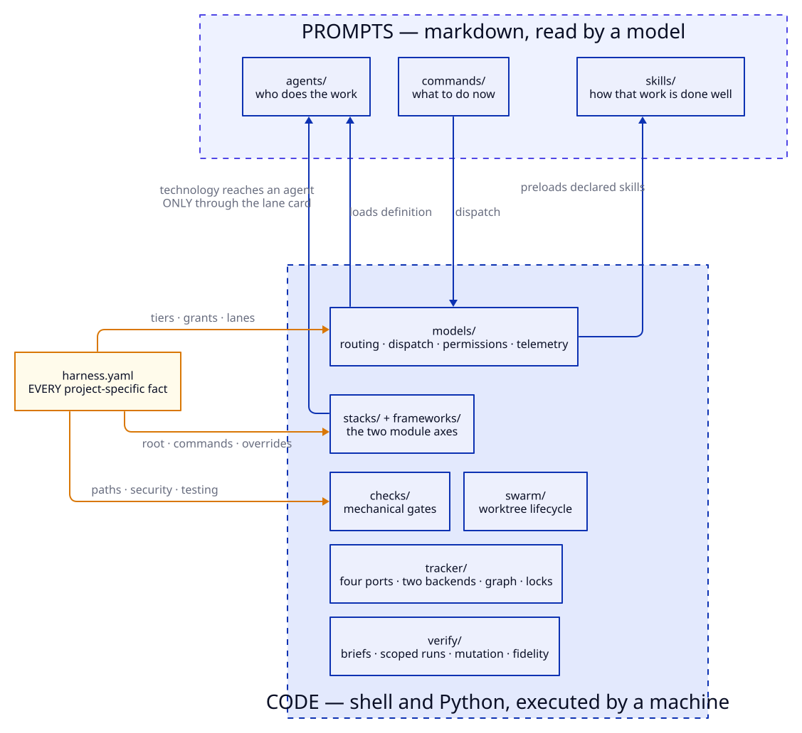

# Architecture

Two halves, deliberately in different places.

| | where | is | fails how |
|---|---|---|---|
| **Prompts** | `agents/` `commands/` `skills/` | markdown read *by a model* | a lens catches it |
| **Code** | `harness/` | shell and Python executed *by a machine* | exits non-zero, a test catches it |
| **Config** | `harness.yaml` | every project-specific fact | `check-project-config.sh` catches it |

The split decides where anything new goes. If a machine can check it, it is code and it
gets a test. If it needs judgement, it is a prompt and it gets a lens.

## Agent, command, skill

Three layers, and the distinction is what keeps prompts small:

| | is |
|---|---|
| an **agent** | *who* does the work |
| a **command** | *what* to do now |
| a **skill** | *how* that kind of work is done well |

A skill is loaded on demand and declared per agent, so doctrine an agent never needs costs
it nothing. That is what makes supporting many technologies free for the projects not using
them — a test asserts that **adding a module leaves every agent's preload bill unchanged**.

## Where a rule belongs

Rules the harness owns are stated *by the harness*, in the two skills that between them
reach every agent (`evidence-gathering`, `spec-lifecycle`), and pinned byte-identical by
`check-conventions-mirror.sh` — which also fails any agent whose preloads include neither.
The orchestrator's rules take the same shape one level up: `harness/orchestrator-card.md`
is mirrored into every command by `check-orchestrator-card.sh`, since a session becomes an
orchestrator by running one, and printed at every session start, resume and compaction by the
plugin's `SessionStart` hook. Duplication is safe only when divergence is mechanical.

They were once cited from a consuming project's `CLAUDE.md`, on the reasonable argument
that duplicating it is pure cost. **That argument inverts once the rule is the harness's**:
then the project's copy is the duplicate, and the harness is treating its own doctrine as
someone else's authority. An audit found 20 of 26 such citations were exactly that.

A project's own conventions still live in the project's own file. The harness requires
nothing from it.

## What is deliberately not here

Application tooling. A script that brings up your real stack, or runs your end-to-end
suite, would exist with no agents involved — so it belongs with your application.

The test: **does it ship, or does it run the agents that build what ships?**

**Agent teams.** Claude Code's agent teams (a lead session spawning teammates with their own
contexts, a shared task list, messaging) do not replace the dispatch boundary, and the
question was put in 2026-09-22 against the docs. Teammates do not spawn in `-p` or SDK
sessions (the campaign, the wavelab and CI are all unattended); a teammate inherits the
lead's effort, so `worker` at high and `strategic` at max cannot coexist; no per-teammate
cost ceiling, cost record, sandbox or permission mode at spawn is documented (prompts go to
the lead for a person to answer); and a teammate loads its definition's tools and model but
not its skills — its doctrine. The one property teams have that the Agent tool lacked, the
reason `guard-agent-tool.sh` exists, is that a teammate's output reaches the lead only by
message. That fits interactive judgement stages where a person is present and the value is
discussion — `/design-debate` is that experiment, with doctrine handed over by file — and
nothing else. Re-evaluate when the docs say: teammates in `-p`/SDK; per-teammate effort;
per-teammate budget and cost record; permission mode or sandbox at spawn; `skills` loaded.

## Subsystems

| directory | owns |
|---|---|
| `models/` | model routing, the dispatch boundary, permissions, config, telemetry |
| `tracker/` | the four ports, two backends, graph, locks, events, render, archive |
| `verify/` | briefs, scoped runs, mutation, fidelity, batched reads and searches |
| `swarm/` | worktree lifecycle, resume, the campaign's mechanical steps (pre-flight, apply-plan, close-epic), the hooks |
| `campaign/` | campaign telemetry |
| `checks/` | the mechanical gates |
| `stacks/` `frameworks/` | the two module axes |
| `wavelab/` | the live differential lab — two repos, two backends, real waves — and the A/B rig that sizes a cost lever |
| `hooks/` (plugin root) | what the plugin installs into a session: the pinned-state hook and the Agent-tool guard |
