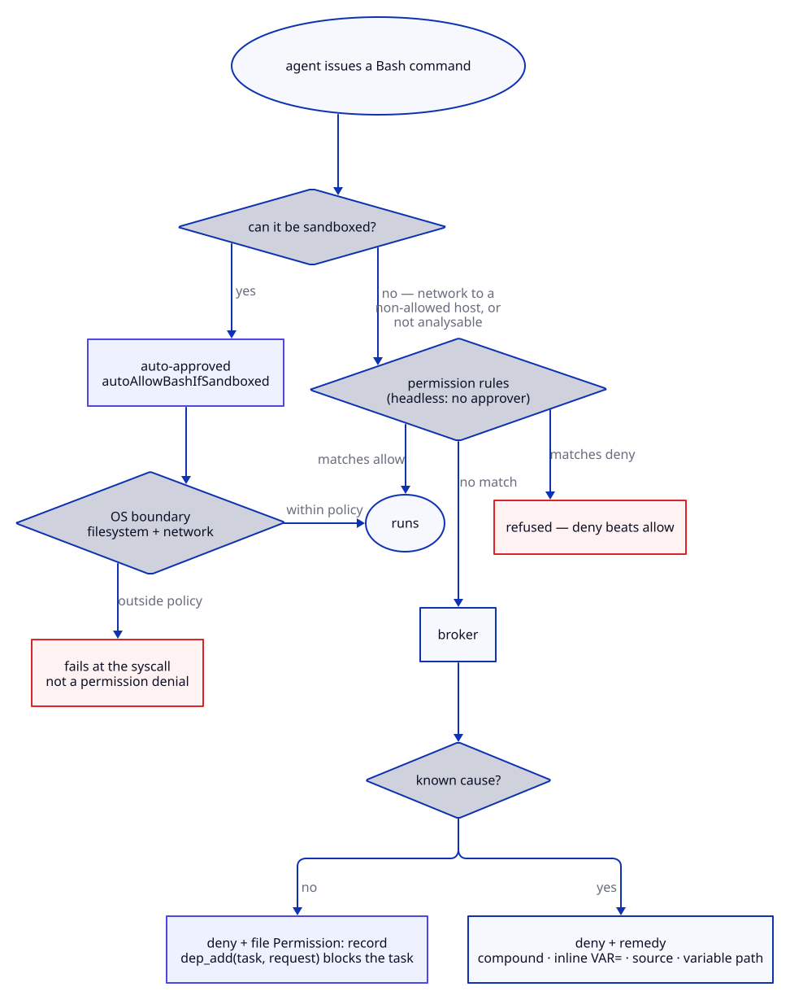
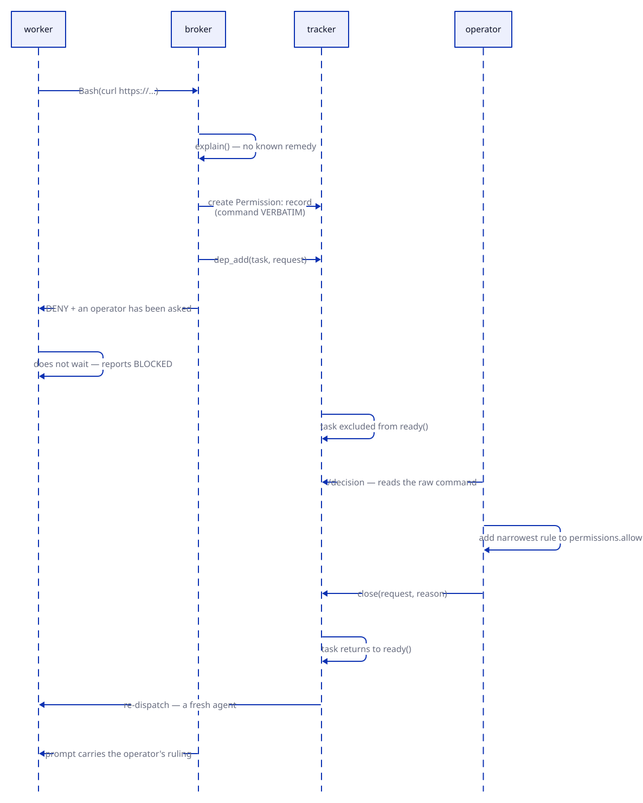

# Permissions

Workers run unattended and merge to the default branch, so the permission model is what
stands between a confused or compromised agent and your repository. It is built from four
layers, and the reason there are four is that each governs something the others physically
cannot express: an OS sandbox cannot encode "a worker never pushes", and a text rule cannot
contain a command it has never seen.

The layering also determines where a change belongs. If you are tempted to widen a grant,
the question is usually which layer the problem actually lives in.



| layer | governs | why it cannot be replaced |
|---|---|---|
| sandbox | what an action can *reach*, for the command and every child | the only layer that holds against a command no rule can describe |
| allowlist | the few commands the sandbox cannot cover | headless has no approver: without a rule, an unsandboxable command is denied |
| deny list | intent | "a worker never pushes" is workflow, not containment |
| operator queue | growth | the only path that widens the allowlist, with recorded consent |

## The sandbox

OS-level containment is the primary boundary, and the only one that holds against a command
no rule can describe — a compound, a heredoc, an inline script. It constrains what an action
can *reach* rather than what it looks like, and it applies to the command and every child
process it spawns.

```python
sandbox = {
    "enabled": True,
    "autoAllowBashIfSandboxed": True,
    "allowUnsandboxedCommands": False,     # closes dangerouslyDisableSandbox
}
settings = {"sandbox": {"filesystem": {"allowWrite": [<cache paths>]}}}
```

`require_sandbox()` runs before anything else in `dispatch()` and raises
`SandboxUnavailable` where containment cannot be enforced. Silent fallback to permission
rules alone is the posture this project does not ship.

| platform | mechanism | status |
|---|---|---|
| macOS | Seatbelt | built in |
| Linux / WSL2 | bubblewrap + seccomp | `apt install bubblewrap` |
| Windows native | — | unsupported; use WSL2 |

**Toolchain caches live inside the boundary.** Granting `~/.cache/uv` does not work — `uv`
fails `EPERM` on a file *inside* the granted directory, not a plain write refusal. The
cache is relocated under the primary checkout via the stack module's `cache_env`, which
both exports the variable and grants the path.

## The derived allowlist

The allowlist exists for the residue the sandbox cannot cover. A command needing network to
a host outside the policy, or one Claude Code cannot establish is safe to sandbox, falls
back to the permission rules — and headless dispatch has no approver, so an unmatched
command is simply denied. Without a rule, that residue would fail silently.

Grants are **derived**, never listed: the agent's own frontmatter decides whether it is a
writer, and the project's declared toolchains contribute the rest. A list keyed by agent
name would go stale the first time an agent changed shape.

```python
permission_for(agent) -> (mode, grants)
# mode:   "acceptEdits" if frontmatter tools contain Edit|Write, else "default"
# grants: harness scripts (both loader spellings) + project toolchains + operator grants
#         + Skill(<name>) for each skill in the lean catalog — the plugin's and the project's own
```

Three grants per agent. Measured across full two-wave runs:

| configuration | denials | tasks closed |
|---|---|---|
| 4 writer / 14 reader grants | 3 | all |
| **no grants at all** | **7 — five were `tk.sh note`** | all |
| harness scripts only | 3 | all |

Removing every grant barely moved the denial count — except that the harness's own tracker
command was refused five times. That is the principle the measurement produced: the
allowlist covers **what a worker runs that is not confined to its worktree**. Git needs no
grant at all, because it operates inside the sandboxed workspace and is auto-approved.

This is worth keeping narrow deliberately. Command allowlists have a documented bypass
class — an allowed command embedded in an arbitrary one — so every entry is a small
liability, and the entries that survived did so because their absence broke something
observable.

## Grants are a ceiling

`setting_sources: ["project"]`. Without it the child loads user and local settings too,
and a lens carrying no git grant was measured running `git add -A` with zero denials
because the machine's owner allowed it. Dropping `user` also drops the plugin
registration, so `plugin_dir` is passed explicitly.

## Commands that can never be granted

Permission rules match command **text**, before shell expansion.

| shape | why | instead |
|---|---|---|
| `a && b`, `a; b`, `a \| b` | a compound matches no rule even when every part is granted | separate calls |
| `VAR=x cmd` | the string starts with `VAR=`, not the command | let the runner supply the env |
| `$DIR/script` | matching is textual; the variable is not expanded first | absolute path |
| `source f` | evaluates its argument as shell code | `verify/run.sh` loads it |

**A compound is the commonest denial, and the doctrine answers it.** 55% of lab dispatches
once hit a denial, every one the same shape: the delete-the-implementation check
hand-rolled as `cp … && cat > … <<EOF … && pytest`. `test-doctrine` §3 does that check as
three granted tool calls, and `evidence-gathering` says when to use `mutate.sh` instead.

## Hooks

The plugin installs two, in `hooks/hooks.json`. Neither widens anything.

| hook | does |
|---|---|
| `PreToolUse` on `Agent` / `Task` — `swarm/guard-agent-tool.sh` | refuses `Agent(subagent_type: <plugin>:<agent>)` and prints the `dispatch.sh` form: the tier, the ceiling, the sandbox and the cost record exist only on that path, and 67.2M tokens went through the Agent tool without them in five field sessions |
| `SessionStart` on `startup` / `compact` / `resume` — `swarm/pinned.sh` | prints the orchestrator card, and the campaign's pinned state (claims, merge slot, worktrees, the loop's rules — from disk, never memory) when one is in flight, naming every id the compaction summary dropped |

Both deny or inform; the plugin never installs a hook that grants.

## The operator queue

The allowlist has to grow sometimes, and the question is who decides. Tuning it by hand is
the documented path to security theatre: policies get loosened incrementally until they
mean nothing. Instead the harness treats "may I run this" as the same kind of question as a
product decision — something a swarm structurally cannot answer for itself, filed for an
operator and answered asynchronously.

The loop is asynchronous by construction. Nobody is watching an unattended campaign, so a
worker that waited on a human would hold the wave open for hours.



| property | enforced by |
|---|---|
| only unexplained refusals become questions | `_is_answerable()` — a known remedy is a malformed command, not a permission problem |
| one request per command | dedup on a SHA-256 digest of the command |
| the operator sees the raw command | justification is model-written text; a prompt-injected agent writes a persuasive one |
| an agent cannot approve its own request | `permissions` is in `check_commands._NORMATIVE` |
| a grant cannot defeat a deny | deny beats allow |
| the task does not spin | `dep_add(task, request)` removes it from `ready()` |
| a refusal is not rediscovered | `resolved_requests(task)` injects the ruling into the next prompt |

Watch the ratio of permission requests to product decisions in `gating-ratio.sh`. A queue
filling with permission requests means the permission model is wrong, not that approvals
should be faster.
