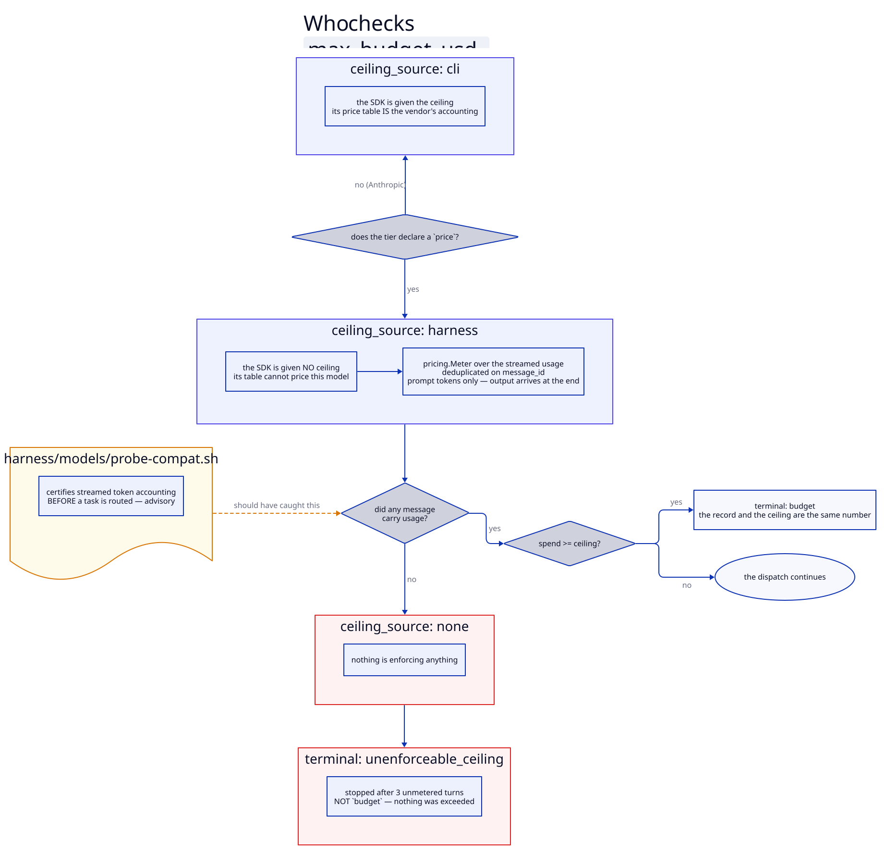

# Providers and pricing

A tier names a provider as well as a model, so any tier can be routed off Anthropic without
touching an agent. What that costs — and what it costs *you* to find out — is the subject of
this page: a third-party endpoint breaks three assumptions the harness had baked in, and each
one is now a declared fact rather than a guess.

The short version: **the plugin ships Anthropic everywhere. Moving a tier elsewhere is a
project's decision, it requires a declared price, and it is gated by a probe.**

## Quick start

Route the `worker` tier at another provider, end to end.

**1. Credentials.** Copy the template and fill it in. The file is gitignored; the tracked
template is `harness/.env.example`.

```bash
cp harness/.env.example harness/.env && chmod 600 harness/.env
```

```sh
DEEPSEEK_BASE_URL=https://api.deepseek.com/anthropic
DEEPSEEK_API_KEY=sk-…
```

**2. Redefine the tier** in your repository's `harness.yaml`. Keys you leave out stay the
plugin's, so upgrades still reach you.

```yaml
tiers:
  worker:
    provider: deepseek
    model: deepseek-v4-pro        # a concrete id, never an alias
    effort: high
    max_budget_usd: 3.00
    price:                        # REQUIRED off Anthropic — see "Pricing" below
      input_per_mtok: 1.32
      output_per_mtok: 3.96
      cache_read_per_mtok: 0.044
      off_peak_multiplier: 0.5
      peak_utc: ["01:00-04:00", "06:00-10:00"]

providers:
  anthropic:
    billing: subscription         # if you are on a plan rather than an API key
```

**3. Prove the provider can actually do the work.**

```bash
harness/models/probe-compat.sh deepseek
```

**4. Run something small and read the record back.**

```bash
make models-cost        # rows never mix a priced tier with an SDK-priced one
```

Every dispatch now records `provider`, `tier_source: project`, `cost_source: priced (…)`,
`billing` and `ceiling_source`. What each means: [cost](cost.md).

## Why a third-party endpoint is not just a different URL

Claude Code honours `ANTHROPIC_BASE_URL` and `ANTHROPIC_AUTH_TOKEN`, so a provider
publishing an Anthropic-compatible endpoint is *reachable* in one line of config. Three
things that the harness depends on are not carried by that compatibility, and none of them
fails loudly.

| assumption | on Anthropic | elsewhere |
|---|---|---|
| the CLI can price a dispatch | true — its table is the vendor's own accounting | **false**, and it returns a plausible number anyway |
| a dollar is a dollar | true | **not comparable** — a plan's allowance and an invoice are different pockets |
| `max_budget_usd` means dollars | true | **false** — it is checked against that same wrong table |

Each is addressed below. The theme is the same one throughout the harness: *a plausible
number is worse than no number*, because nothing downstream can tell it is wrong.

## The compatibility probe

"Anthropic-compatible" is a claim about an API surface, not a guarantee about the parts an
agent harness leans on. A provider can return perfect single-shot completions and still fail
to sustain a multi-turn tool loop — and that failure does not look like an error. It looks
like a worker that read no files and confidently produced nothing, which the lenses then
judge as bad work rather than as a broken provider.

```bash
harness/models/probe-compat.sh <provider>
```

Six probes, cheapest and most fundamental first, each naming what depends on it:

| probe | certifies | gates? |
|---|---|---|
| reachability | the endpoint answers at all | yes |
| instruction following | the ten-line worker return contract is followable | yes |
| token accounting | every cost record and A/B series is computed from it | yes |
| **streamed token accounting** | the per-dispatch ceiling is enforced from it, turn by turn | **no — advisory** |
| tool call (read) | a worker that cannot read a file cannot work | yes |
| multi-turn tool loop | the failure mode is a worker that silently does nothing | yes |

The model probed is the one a tier on that provider declares, so the probe exercises the
real path rather than a parallel one that could pass while it fails.

**Why one probe is advisory.** Streamed usage is what the ceiling is metered from; the final
usage is what the cost record is built from. They are different payloads, and a provider can
report exact totals at the end and nothing on the way. That costs the *ceiling*, not the
cost record and not the work — so refusing the provider over it would be disproportionate.
It prints `WARN` and names `task_budget_tokens` as what stands in. Every other probe is a
gate: a non-zero exit means **do not route a task here**.

## Pricing

`cost_usd` on a dispatch record used to be the SDK's `total_cost_usd` unconditionally. On
Anthropic that is the vendor's accounting and it is right. Against an endpoint reached
through `ANTHROPIC_BASE_URL`, Claude Code is applying its own price table to a model it does
not recognise, and the result is not an error — it is a number.

> Measured three times against DeepSeek, 2026-09-23: a flat **$5.00 per Mtok of input**
> (35,335 tok → $0.17675; 27,845 → $0.1393; 1,909 → $0.00962), where the published rate is
> $0.66 off-peak / $1.32 peak. Measured again end to end: $0.1600 reported against $0.015494
> of real cost, and $0.1105 against $0.011348 — **9.7–10.3×**.

So a tier on a non-Anthropic provider **must** declare a `price` block, and
`check-project-config.sh` refuses it by name when it does not. The cost is then computed
from the token counts the probe certified.

```yaml
price:
  input_per_mtok: 1.32          # required
  output_per_mtok: 3.96         # required
  cache_read_per_mtok: 0.044    # optional — defaults to the input rate
  cache_write_per_mtok: 1.32    # optional — defaults to the input rate, never free
  off_peak_multiplier: 0.5      # optional
  peak_utc: ["01:00-04:00", "06:00-10:00"]   # optional; outside these, off-peak
  peak_weekdays_only: true      # optional, default true
```

**Peak windows are data, not a constant.** A provider that charges half rate outside stated
hours makes "assume peak" and "assume off-peak" both a 2× error, so the windows are declared
and the rate is chosen by the dispatch's own start time.

**A cache read is never silently free.** Where a provider states no cache rate, the input
rate is used — an optimistic default here would understate every cached dispatch, which is
most of them.

`cost_source` on every event says which of the two numbers it is — `sdk` or
`priced (window: rates)`. `make models-cost` never shares a row between them, and the A/B
report flags an arm that mixes them, because comparing an estimate against a computation is
not a series.

## Which pocket: `billing`

A dispatch on a subscription plan is not free. The allowance is finite and the work stops
when it is gone — a consumed subscription-dollar is one no longer available. But it is not
an invoiced dollar either, and a report that adds the two states a figure neither pocket
paid.

```yaml
providers:
  anthropic:
    billing: subscription     # a plan's allowance
  deepseek:
    billing: metered          # billed per token — the default
```

The plugin declares nothing here, because only the operator knows: an Anthropic API key is
metered and a Max plan is not. Both reports total the two **apart** and never sum them, and
an A/B whose arms spend from different pockets reports each pocket's delta separately rather
than one meaningless percentage.

## The ceiling



`max_budget_usd` is a circuit breaker per dispatch. Who actually checks it depends on
whether the harness can price the tier, and every event records the answer as
`ceiling_source`.

### `cli` — on Anthropic

The SDK is given the ceiling and enforces it between API calls. Its figure is the vendor's
own accounting, so this is correct and nothing else is needed.

### `harness` — on a tier that declares a price

The CLI is given **no ceiling at all**. It would be checking the number against its own
table for a model it does not know, so its kill would land at a real-dollar figure nobody
can state — and a threshold in an unknown currency is not a bound.

> This shipped a "loosened backstop" first — the CLI's ceiling multiplied by 10, then 25.
> At 10× it landed within a few percent of the real ceiling and *raced the meter it was
> meant to back up*. The fix was not a bigger multiple; it was noticing that the multiple
> was denominated in the wrong currency.

Instead, the dispatcher meters the stream it is already reading. Each message carries its
own usage; summed at the tier's declared rates, that is the same number the record will
show, which is what makes the ceiling mean what it says. Two measured properties of a real
stream shape the implementation:

- **One API response arrives as several messages** — a thinking block, then a tool-use block
  — each carrying the *same* usage and the same `message_id`. Ten messages for what the
  result counted as five turns. Summing them as they arrive doubles the cost, so usage is
  deduplicated on `message_id`. Deduplicated, the totals are exact: 13,378 input and 53,120
  cache-read against the result message's own 13,378 and 53,120.
- **A streamed usage reports `output_tokens: 0`.** The real figure appears only in the final
  result message, which a killed dispatch never receives. So the meter prices **prompt
  tokens only**, says so in the derivation, and the ceiling is therefore reached slightly
  *late* — never early. On the measured sample output was 11.9% of the cost. Estimating it
  from the visible text would be exactly the kind of plausible number this design exists to
  keep out of the record. A dispatch that completes is priced in full, output included.

### `none` — priced, but nothing could meter it

The tier declares a price, so the CLI was given no ceiling, and the provider streamed no
usage — nothing is enforcing anything. This is caught twice:

1. `probe-compat.sh` reports it before a task is ever routed there (the advisory probe).
2. At runtime, a dispatch that has run three turns without a single usage payload is
   **stopped**: `terminal: unenforceable_ceiling`. That is deliberately not `budget` —
   nothing was exceeded. It is a configuration fault to fix, not a task to split or a tier
   to escalate.

## Limitations, stated

| limitation | why | what to do |
|---|---|---|
| the ceiling is checked between turns | one enormous tool call can carry past it (measured 22× on a $0.005 ceiling) | set ceilings to "obviously too much for this tier's work"; use `task_budget_tokens` to pace |
| a metered ceiling reaches ~12% late | streamed usage carries no output count | treat the ceiling as a runaway stop, not a cap |
| a `price` block can be wrong | nothing verifies your rates against the provider's invoice | reconcile `make models-cost` against a real bill once |
| the probe certifies one model | it probes the model a tier on that provider declares | probe again after changing the model |
| `model:` must be a concrete id | an alias resolves differently per dispatch path, silently | see [agents and tiers](agents-and-tiers.md) |

## What this measured

A worker tier at DeepSeek V4 Pro against the plugin's Sonnet default, 2 runs per arm on the
seeded lab epic, judged by all four lenses: workers **$0.15/run metered against $1.56/run
subscription (~10×)**, both arms green, and the same lens verdicts. At the wave level that
is −22% of the subscription pocket, because the Opus lenses are ~76% of a run — on this
shape of work, judging costs more than doing.

The full result, including what it did *not* show at n = 2: [upgrading](../upgrading.md)
§ 0.10.33. How a number like that is produced and when it is allowed to move a default:
[measurement](../guides/measurement.md).

## See also

| | |
|---|---|
| [Cost](cost.md) | every field a dispatch records, the levers, where a campaign's money goes |
| [Agents and tiers](agents-and-tiers.md) | what a tier is and how one is selected |
| [harness.yaml](../reference/harness-yaml.md) | the `tiers`, `providers` and `price` blocks |
| [Measurement](../guides/measurement.md) | the A/B rig that sized the comparison above |
