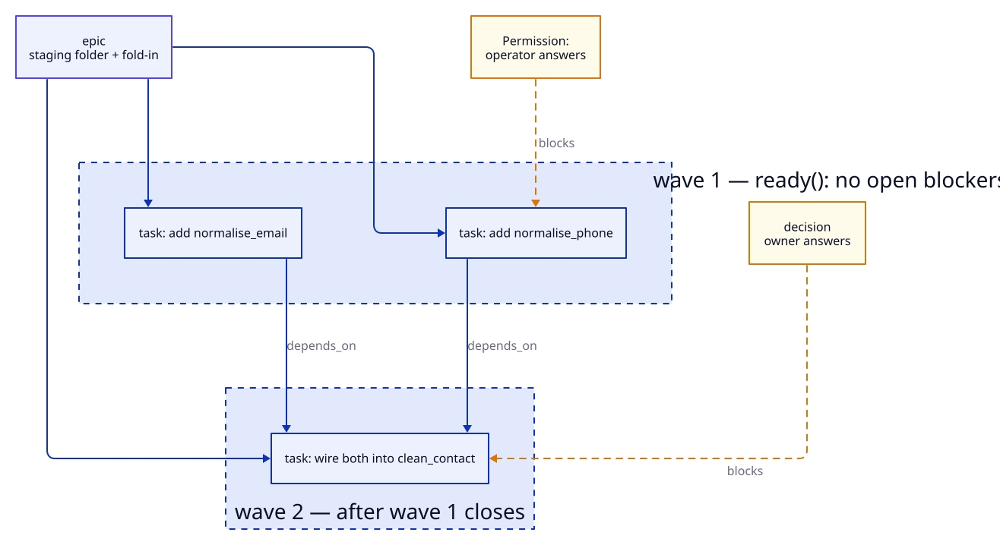
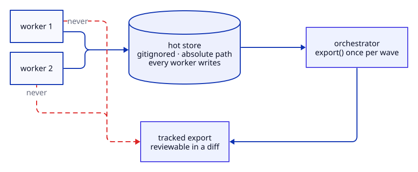

# Tasks and tracking

The harness schedules from a **graph**, not a list. That single choice is what makes
parallel waves possible: `ready()` is a transitive dependency walk, so two tasks are
dispatched together precisely because nothing in the graph says they cannot be. A list
would require someone — or some model — to decide ordering on every wave.



## Record types

| type | semantics | closed by |
|---|---|---|
| `epic` | a unit with a staging folder and a fold-in | the campaign, at close-out |
| `task` | one dispatchable piece with acceptance criteria | the worker that implements it |
| `decision` | a question only the owner can answer; gates work behind it | `/decision` |
| `gate` | an explicit block on an epic, with a reason — made by `tk.sh park`, which also sets the epic `blocked` (the gate alone does not remove it from the queue) | `tk.sh unpark` |

A `Permission:` record is a `decision` with a title prefix rather than its own type. One
backend validates its type vocabulary and rejects unknown values, so a new type would work
on one backend and fail on the other — a silent one-backend feature. The prefix keeps the
queue's composition countable, which is the property that actually mattered.

## Waves

`validate(epic)` levels the DAG and reports what would break a wave:

```python
@dataclass(frozen=True)
class Validation:
    ok: bool
    waves: list[Wave]        # levelled
    cycles: list[...]        # a cycle is unschedulable
    orphans: list[...]       # no parent epic
    max_parallelism: int
```

Two tasks touching the same file are not placed in one wave. That is a **planning**
constraint enforced before dispatch — see
[`work-decomposition`](../../skills/work-decomposition/SKILL.md) — rather than a merge
conflict discovered afterwards, because by then two workers have each spent a dispatch.

## Backends

| backend | storage | external dependency |
|---|---|---|
| `mdfiles` | one markdown file per open record, closed records compacted to `archive.jsonl` | none |
| `beads` | a `bd` database with a JSONL export | `bd` on PATH |

Declared in one `tracker:` block. Both satisfy the same 54-test conformance contract, run
against the **real** binaries rather than mocks — two assumptions about `bd` turned out to
be wrong the first time they met the real CLI, which is the argument against mocking here.

```yaml
tracker:
  backend: mdfiles
  dir: .harness/tasks        # hot store, gitignored
  export: docs/tasks         # tracked artefact, orchestrator-written
```

### Switching between them

```bash
tk.sh migrate --to mdfiles --dry-run    # how many records would move
tk.sh migrate --to mdfiles              # move them
```

Ids are **not** preserved — each backend mints its own — so every dependency and parent
edge is rewritten through a map built while creating. The source is never modified, so a
partial run is recoverable by fixing the reported record and re-running into a clean
target. See [tracker ports](../reference/tracker-ports.md#switching-backends).

## The two-store model



The split exists because two requirements conflict. Workers must all write one store, so
it is addressed absolutely and gitignored — a tracked file written mid-wave leaves the
primary checkout permanently dirty and fails the next wave's clean-tree gate. But the task
state should be reviewable, so a tracked artefact is regenerated once per wave by a single
actor.

`mdfiles` compacts closed records into `archive.jsonl` at close. In a database keeping every
closed record is free; in markdown, `ready()` would parse them on every call. `show()` falls
back to the archive, because a reference to a closed task must resolve — otherwise
"dependency satisfied" is indistinguishable from "dependency missing".

## Verifying parity

The contract proves both backends obey every rule someone wrote down. The differential asks
the question it cannot: given the same base and the same epic, did real agents reach the
same place?

```bash
harness/wavelab/reset.sh
harness/wavelab/dispatch-wave.sh beads   && harness/wavelab/merge-wave.sh beads
harness/wavelab/dispatch-wave.sh mdfiles && harness/wavelab/merge-wave.sh mdfiles
harness/wavelab/compare.sh    # IDENTICAL, or the difference
```

It compares outcomes and deliberately not ids, timestamps, backend storage paths, or
permission records — all of which differ by construction or by agent behaviour. A
differential that can never report IDENTICAL teaches its reader to ignore it.
