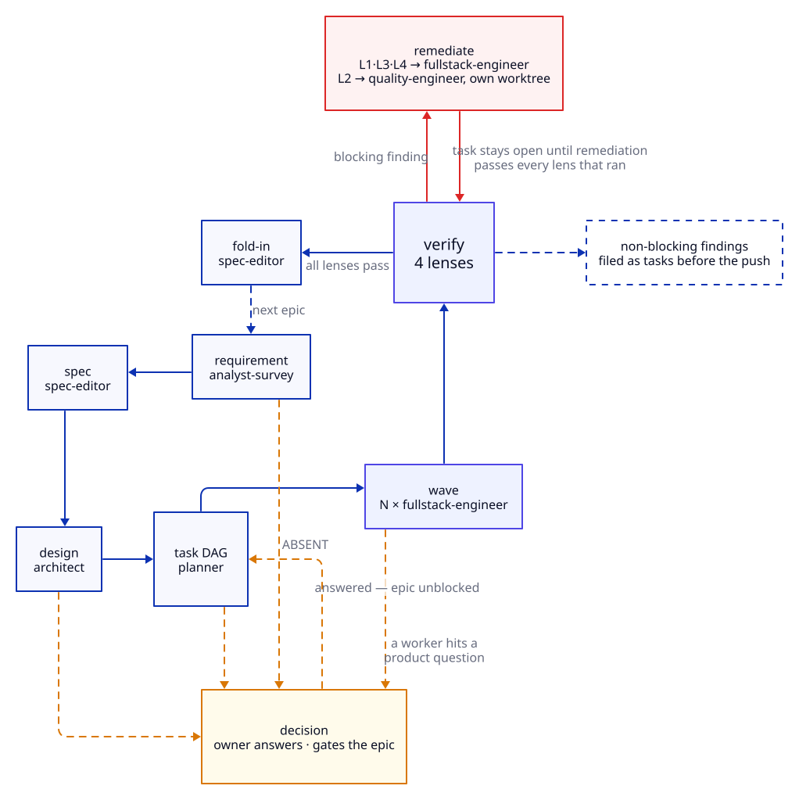
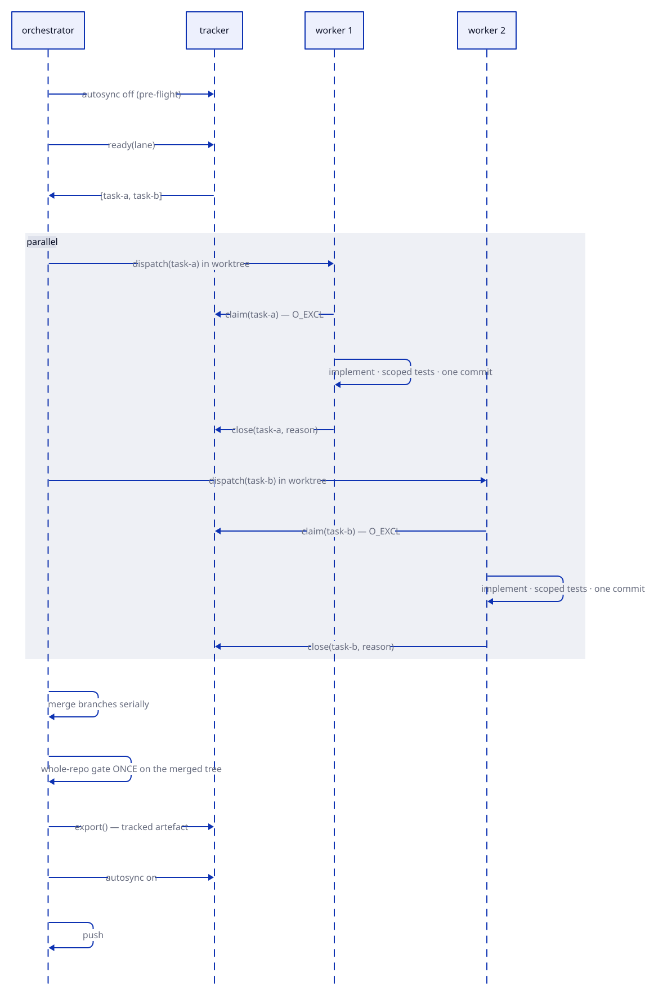

# The loop

Requirement to merged code. Each stage has an owner, an artefact, and a gate that decides
whether it advances.



| stage | command | owner | advances when |
|---|---|---|---|
| requirement | `/requirements` | `analyst-survey` → owner | verdict is ADEQUATE or INFERABLE, not ABSENT |
| spec | (in loop) | `spec-editor` | `proposal.md` exists in the staging folder |
| design | `/design` | `architect` | `design.md` names the approach and its trade-offs |
| tasks | `/plan-swarm` | `planner` | `apply-plan.sh` has applied the plan and `validate` reports no cycles, no orphans, no intra-wave file collisions |
| wave | `/swarm` | `fullstack-engineer` ×N | every task committed, whole-repo gate green |
| verify | (in wave) | 4 lenses | every **blocking** finding remediated and re-verified; non-blocking findings filed |
| fold-in | `/landit` or campaign | `spec-editor` | staging folder archived, durable docs carry its content — `close-epic.sh` refuses the close until it is |

`/campaign` iterates this over the epic queue, one epic per session — the boundary is
where the orchestrator's context is cleared, for the reason in [cost](cost.md);
`/campaign-auto` runs it unattended. `/grind` is the serial alternative to a wave.

## Verification is a loop, not a step

A lens verdict is not advisory, and it is not uniformly blocking either. The routing
depends on what kind of finding it is, and the distinction decides whether the task is
done.

| finding | routed to | when |
|---|---|---|
| L1 / L3 `blocking` — wrong behaviour, unmet criterion, broken caller, stale doc or ADR | `fullstack-engineer`, with the finding list | immediately |
| L4 `blocking` — authorization, isolation, exposure, injection, secrets | `fullstack-engineer`, **and the task's priority is raised to match severity** | immediately |
| L2 test-shaped — decorative assertion, untested path, weakened test | `quality-engineer`, in its own worktree | after the merge |
| non-blocking — efficiency, performance, style | filed as tasks before the push | does not hold the wave |

**The task stays open until the remediation itself passes every lens that ran.** That is
the iteration: implement, judge, remediate, re-judge — not a single pass with a verdict
attached.

The split exists because a reviewer that can block everything stalls waves on taste, and
one that can block nothing gets ignored. So severity decides: correctness and security
hold the task open; quality observations become work someone scheduled.

A near-zero FAIL rate across the lenses is not reassurance. It means the gate has gone
soft.

## Decisions come from any stage

A `decision` is a product, spec or design question the swarm structurally cannot answer.
The architect, the planner and a worker can all surface one — it is not a requirements-stage
phenomenon.

```bash
tk.sh create "<the question>" -t decision -p 1 --description "<options and trade-offs>"
tk.sh gate create <epic-id> --reason "<what decision is owed>"
tk.sh update <epic-id> --status blocked    # the gate alone does NOT park the epic
```

All three commands are required. A gate without the status change leaves the epic
selectable, and the loop picks it up again on the next pass.

## Wave execution



Two properties this ordering encodes:

**The gate runs once, on the merged result.** Not per branch. A defect that only appears
when two workers' changes meet is invisible to a per-branch gate, and the merged tree is
what ships.

**The export is written by one actor, after the merge.** Eight workers writing it produces
eight conflicting versions of one file. See [workers](../reference/workers.md).

## Why the spec precedes the code

Folding in at close means the spec is written by whoever just built the thing, and
faithfully documents the shortcut. Written first, it is an independent target the lenses
judge against — which is the only way L3's verdict means anything.

## Scheduling is deterministic — and so is applying, closing and pre-flight

`ready()` and `validate()` are graph walks in `tracker/graph.py`. No model decides what runs
next: a topological sort already has the answer, costs nothing, and does not vary between
runs. The same rule now covers the loop's other mechanical sequences: `preflight.sh`,
`apply-plan.sh` (the planner's labelled command block, validated whole before anything is
written) and `close-epic.sh` are scripts, because a step with no judgement in it costs
nothing as a script and ~$0.17 a call as a model turn at the orchestrator's context size.

## Procedure

The stage-by-stage procedure is doctrine, and lives where agents load it:

| skill | covers |
|---|---|
| [`campaign-loop`](../../skills/campaign-loop/SKILL.md) | epic iteration, every stage |
| [`spec-lifecycle`](../../skills/spec-lifecycle/SKILL.md) | staging folders, fold-in, archival |
| [`work-decomposition`](../../skills/work-decomposition/SKILL.md) | slicing a DAG a wave can run |
| [`worker-protocol`](../../skills/worker-protocol/SKILL.md) | the worker contract |
