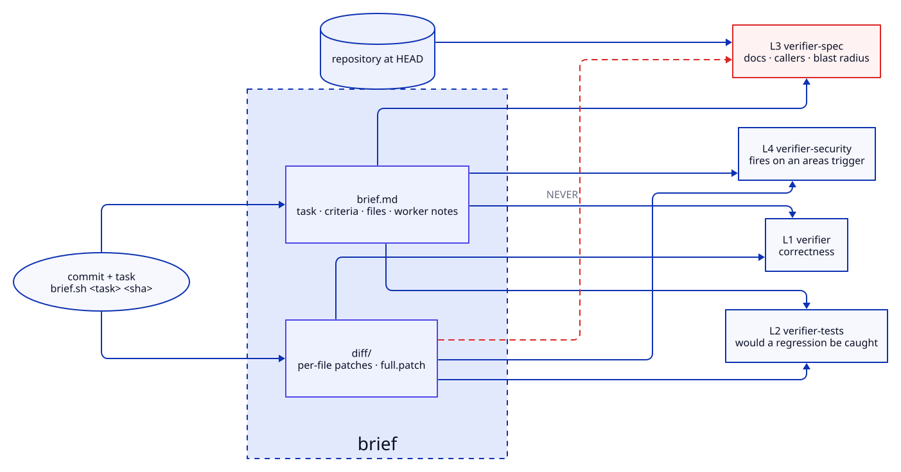

# Verification

Four lenses judge completed work independently. The design rests on one idea that is easy
to state and easy to break: **decorrelation**. Lenses reading the same evidence make the
same mistakes, so their agreement proves nothing. Each is therefore given a deliberately
different view, and the enforcement of that difference is structural rather than advisory.



| lens | agent | judges | evidence |
|---|---|---|---|
| L1 | `verifier` | correctness against acceptance criteria | brief body + `diff/` |
| L2 | `verifier-tests` | would these tests catch a regression | brief body + `diff/` + suite |
| L3 | `verifier-spec` | docs, callers, blast radius | brief body + **repo at HEAD** |
| L4 | `verifier-security` | what a wrong actor could do | fires on an `areas[].triggers` match |

## Why L3 must not see the diff

This is the rule most likely to be "helpfully" broken by someone tidying up, so the reason
matters more than the rule.

A lens shown the diff judges *the change*. L3's job is to judge **what the repository now
claims** — whether a docstring still tells the truth, whether a caller still holds, whether
two documents now disagree. Given the diff it starts reviewing the patch like the others,
and four lenses collapse into one opinion held four times.

The separation is physical, not instructional: `brief.py` writes the body and `diff/` as
separate artefacts, and L3's prompt is given the body path only.

Two runs from this repository's own test lab:

- L1 read the patches and passed a task. L3 reasoned from the repository and failed it,
  having found `(+61) 400 000 000` silently losing its international prefix.
- Both failed a later task after L3 hand-traced `"\t+61 400"` through code whose docstring
  promised whitespace handling it did not implement.

Neither finding is visible in a diff. Both are visible in the repository.

## The brief

```bash
harness/verify/brief.sh <task-id> [commit-ish] [--out DIR]
# stdout: path to brief.md
# stderr: size comparison and notes
```

Computed once and handed to every lens, so four dispatches do not each re-read the
repository. The streams are separate for a reason worth knowing: stdout is block-buffered
to a file while stderr is not, so merging them and taking the first line yields the size
note rather than the path.

```
<root>/<task>-<sha>/
├── brief.md        task, criteria, files changed, worker notes   [safe for L3]
└── diff/
    ├── <file>.patch                                              [L1, L2, L4 only]
    └── full.patch
```

Default root follows `SCRATCHPAD`/`TMPDIR` — briefs are scratch, and deliberately outside
the repository. A dispatched lens therefore cannot read one without `add_dirs` carrying the
briefs root, which is why a `Read(<dir>/**)` grant does not work here.

## Verdicts

A FAIL is not a veto on shipping. It is a finding that must be **filed before the push** —
the gate's value is that a finding cannot be silently dropped, not that it halts the world.
Routing is part of the verdict: a test-shaped finding goes to `quality-engineer`, a
code-shaped one to `fullstack-engineer`.

Verdicts vary between runs on genuinely ambiguous criteria. Treat that as information about
the criterion rather than about the lens: a criterion two careful readers can disagree
about is a spec defect, and `analyst-survey` exists to catch those before any code is
written. The fix is a worked example in the acceptance criteria, not a stricter lens.

## Related doctrine

| skill | covers |
|---|---|
| [`verification-gate`](../../skills/verification-gate/SKILL.md) | what each lens may see, and the routing rules |
| [`test-doctrine`](../../skills/test-doctrine/SKILL.md) | what "tested" means here — what L2 judges against |
| [`evidence-gathering`](../../skills/evidence-gathering/SKILL.md) | finding what is true without exhausting the budget |
