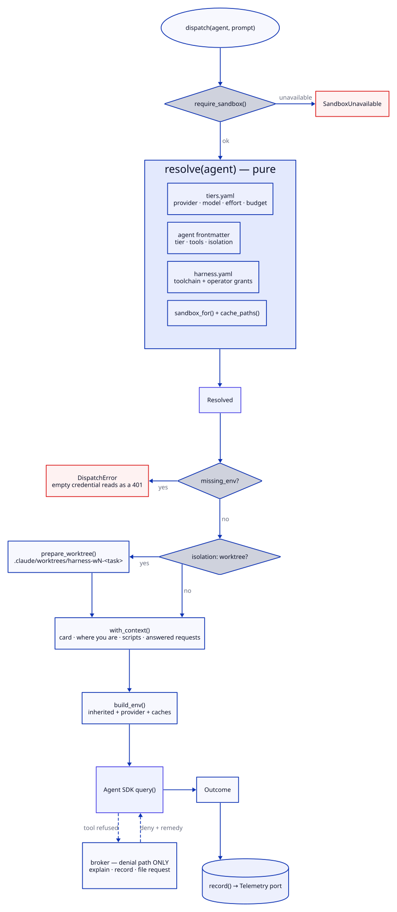

# Dispatch

One agent invocation: config resolution, containment, execution, telemetry.
`harness/models/dispatch.py`, `harness/models/resolve.py`.

## Data flow




## Types

```python
@dataclass(frozen=True)
class Resolved:
    agent: str; tier: str; reason: str          # why this tier won
    provider: str; model: str; effort: str
    max_budget_usd: float                        # the ceiling the CLI enforces between calls
    task_budget_tokens: int | None               # the budget the model is TOLD — env > harness.yaml > tier
    env: dict[str, str]                          # provider credentials
    missing_env: tuple[str, ...]                 # unset -> refuse to dispatch
    permission_mode: str = "default"             # or "acceptEdits"
    allowed_tools: tuple[str, ...] = ()
    disallowed_tools: tuple[str, ...] = ()
    add_dirs: tuple[str, ...] = ()               # readable outside cwd
    setting_sources: str = "project"
    sandbox: dict[str, Any] = field(default_factory=dict)
    settings: str = ""                           # JSON: sandbox.filesystem
    plugin_dir: str | None = None

@dataclass(frozen=True)
class Outcome:
    resolved: Resolved
    ok: bool                                     # see "ok is not success"
    text: str
    cost_usd: float                              # client-side estimate
    input_tokens: int; output_tokens: int
    cache_read_tokens: int; cache_creation_tokens: int
    turns: int; duration_ms: int; session_id: str
    permission_denials: list[Any]
    raw: dict[str, Any]                          # diagnostics only
    results: ResultVolume | None                 # the tool-result cost, read from the transcript; None = not found
    # derived: terminal ("success" | "budget" | "max_turns" | "usage_limit" | "api_error" | "error"),
    # budget_exhausted, transcript (the steps that arrived before a terminal error),
    # prompt_tokens, cache_hit_pct, cache_write_pct
```

A closed usage window (`usage_limit`) is a terminal outcome too, and never a success: the
CLI returns "You've hit your session limit" as the result text with `subtype: success`,
and 26 such runs were once recorded as passes. The A/B rig stops a series on it.

**A terminal error is an outcome, not a crash.** The CLI ends a budget kill, a turn cap or
an API failure with an error `result` carrying the cost and turns accrued; the SDK raises
it as `ResultError` with that payload attached. `_run_sdk` returns the payload — and the
transcript it kept as the run streamed — so the dispatch is recorded with the spend that
caused it and the orchestrator sees what the worker did, not a traceback in place of it.
`dispatch.sh` exits **3** on a budget kill (`EXIT_BUDGET`), distinct from a worker that ran
and returned not-ok (1), so a pipe like `dispatch.sh … | tail` has something to notice.

## Tier resolution

First match wins:

| # | source | set by |
|---|---|---|
| 1 | explicit override | `--tier`, or `escalate.py` |
| 2 | policy | `--high-risk` forces up regardless of 3–5 — a project override can never lower a high-risk dispatch |
| 3 | project override | `tiers:` in `harness.yaml`, agent → tier; the A/B switch for moving a lens between tiers |
| 4 | agent default | `model_tier:` in frontmatter |
| 5 | global default | `default_tier:` in `tiers.yaml` |

`Resolved.reason` records which applied (`project override (harness.yaml tiers)` for 3),
so the telemetry says why. `check-model-config.sh` fails the build if an agent names a
tier that does not exist, and judges the plugin's defaults rather than a project's
overrides; a malformed `tiers:` block stops the dispatch rather than falling through.

## `ok` is not "the model returned something"

```python
ok = (not payload["is_error"]
      and payload["subtype"] == "success"
      and not payload["permission_denials"])
```

Headless has no approver. A denied tool does **not** abort the run — the SDK denies the
call, the model continues, and the result returns `subtype: success`. A worker denied its
test command can and does report PASS. Any denial therefore marks the dispatch not-ok, and
the caller decides whether the task still completed.

## Injected prompt sections

`with_context()` appends to the prompt, in this order:

| section | contains | source |
|---|---|---|
| Technology context | the lane's stack/framework cards | `context.render_card(lane)` |
| Where you are | cwd, project root, harness root, and the absolute script paths (why not `$VAR`) | `cwd` arg, `REPO`, `HARNESS` |
| Permission requests already answered | operator rulings for this task | `broker.resolved_requests(task)` |
| Harness conventions | task glosses, cite-by-symbol — belt and braces for an agent that preloads no carrier skill | inline |
| Preloaded skills | the `preload` lever's skills, and under `preload_declared` the agent's own frontmatter `skills:` | `_preloaded_skills(agent)` |

`cwd` is the **worktree** for an isolated agent, not the project root. Passing the project
root caused workers to go looking for their own location — 17 denials in one wave.

**Frontmatter `skills:` do not preload on their own under `--agent` dispatch.** The CLI
preloads an agent's declared skills only when it spawns that agent through the Agent tool,
which the harness never does; a dispatched writer and lens both reported every declared
skill absent. `dispatch.preload_declared` appends them here instead; until it is on, an
agent loads its doctrine on demand through the Skill tool, which its body tells it to do.

## The catalog and the connectors

Under `dispatch.lean_catalog` (on by default) the SDK options name the Skill catalog: the
plugin's skills plus the project's own `.claude/skills/*`, carried as `Skill(name)`
grants. That drops 17 bundled CLI skills and the 10 orchestrator commands from a worker's
catalog — 26,130 → 22,743 tokens on its first request — and puts `/swarm` and `/halt` out
of a worker's reach. The account's claude.ai MCP connectors are disabled for every
dispatch (`disableClaudeAiConnectors`): one attached to every worker and put ~500 tokens
of instructions into its first message for tools the agent's `tools:` never lets it call.

## The result file

Every dispatch writes the agent's whole result to
`.harness/run/out/dispatch-<agent>-<task>-<HHMMSS>.md` under the project (`--out` names
it). Without `--digest` stdout is the full result plus one trailing `full: <path>` line;
with `--digest [N]` it is the first N lines (default 40) and the absolute path. The
orchestrator reads the verdict line and hands the path on — to `tk.sh note --file`, to
`apply-plan.sh`, to the next prompt — instead of carrying the body in its context. If the
file cannot be written the result is printed in full and the failure is on stderr; a
digest with nowhere to point would lose the result.

## Refusals

```python
require_sandbox()          # before anything else; raises SandboxUnavailable
if r.missing_env: raise DispatchError      # empty credential -> 401 that reads as an outage
if needs_worktree(agent) and cwd == REPO: raise DispatchError
```

## Telemetry

`record()` appends one event per dispatch through the Telemetry port:

```python
{"agent", "task", "attempt", "tier", "reason", "model", "effort", "max_budget_usd",
 "task_budget_tokens", "cost_usd", "input_tokens", "output_tokens",
 "cache_read_tokens", "cache_creation_tokens", "cache_hit_pct", "cache_write_pct",
 "models", "turns", "duration_ms", "ok", "terminal", "experiment", "levers",
 "permission_denials", "denied_tools", "env_names", "missing_env", "escalated_from",
 # from the session transcript, when it is found:
 "tool_results", "tool_result_chars", "large_results", "carried_result_tokens",
 "result_chars_by_tool", "cache_breaks", "cache_break_reasons", "rewritten_tokens"}
```

Every field is explained in [cost](../concepts/cost.md).

`cache_hit_pct` and `cache_write_pct` are shares of all prompt tokens the dispatch sent
(fresh + written + read). They are the numbers a cost analysis otherwise has to
reconstruct from transcripts by hand: workers in one wave that each start cold show as a
low hit rate; a resumed agent shows as ~0. `terminal` is why the run ended, so a tier
that keeps being killed by its ceiling is visible in `make models-cost` as `kills`.

`env_names` carries variable **names**, never values — `Resolved.redacted()` is the only
serialiser, because a provider token rendered into a record survives in the tracked export.

Recording failures are reported and swallowed: telemetry must never fail a dispatch that
already succeeded.

Read it back with `make models-cost`.

## CLI

```bash
harness/models/dispatch.sh <agent> --prompt-file F [options]

  --tier TIER        override (rank 1)
  --high-risk        force policy escalation
  --task ID          attaches telemetry + permission-request context
  --attempt N        re-dispatch counter
  --worker N         prepare and use an isolated worktree
  --resume BRANCH    reattach to the branch's existing worktree — REATTACH or a failed VERIFY
  --lane LANE        selects the technology card
  --cwd PATH         explicit working directory
  --dry-run          resolve and print; spend nothing
  --no-record        skip telemetry
  --out PATH         where the whole result is written
  --digest [N]       print the first N lines (40) and the path, not the result
```

Exit codes: 0 ok, 1 ran and not-ok, 2 a config or dispatch refusal, 3 killed by the
budget ceiling.

## The orchestrator role

An agent whose frontmatter says `role: orchestrator` (today `campaign-orchestrator`) runs
the loop rather than a task in it, and the boundary differs in exactly three ways: the
`git push` deny does not apply and `Bash(git:*)`, `Bash(make:*)` are granted; the sandbox's
egress opens to the remote and to each declared stack's `network:` (its package index);
and `dispatch.sh` itself is in `excludedCommands`, so a worker it dispatches gets today's
topology — an unsandboxed dispatcher, a sandboxed worker — rather than a nested sandbox
in which the CLI cannot reach the keychain to log in (measured: `Not logged in`). Every
sandbox field goes in the SDK's `sandbox` option, never the settings JSON: the transport
replaces the settings' sandbox block with the option wholesale.

**What a child never inherits.** The SDK spawns with `{**os.environ, **options.env}`, so
`_run_sdk` scrubs `MAD_HARNESS_CALLER_PWD` and `VIRTUAL_ENV` from the dispatcher's own
process first — a variable merely absent from `build_env`'s result was inherited anyway,
which is how every worker's `run.sh` kept resolving to the primary checkout after 0.10.3.

## Hooks

The plugin installs two (`hooks/hooks.json`), both silent unless they have something to say:

| event | script | does |
|---|---|---|
| `SessionStart` (`startup`, `compact`, `resume`) | `swarm/pinned.sh --hook` | prints the orchestrator card; when a campaign is in flight, also the pinned state — claims, merge slot, worktrees, the loop's rules, read from disk — and names every pinned id the compaction summary dropped. Silent inside a dispatched agent |
| `PreToolUse` (`Agent`, `Task`) | `swarm/guard-agent-tool.sh` | refuses `Agent(subagent_type: <plugin>:<agent>)` with the `dispatch.sh` form to use instead; built-in and other plugins' agents pass |
| `PreToolUse` (`Bash`) | `swarm/allow-prefixed-wrapper.py` | in a dispatched session only: allows a harness wrapper called with an env-assignment prefix (`VAR=x …/tk.sh …`, `env -u X …/run.sh …`) — one simple call, never a pipe, substitution or `git push`; the commonest denial shape, and innocuous under the sandbox. Plain python3, not the uv wrapper, because it runs on every Bash call |

`--dry-run` prints the tier, model, budget, permission mode, grants, deny list and
readable directories. Use it before believing anything on this page.
