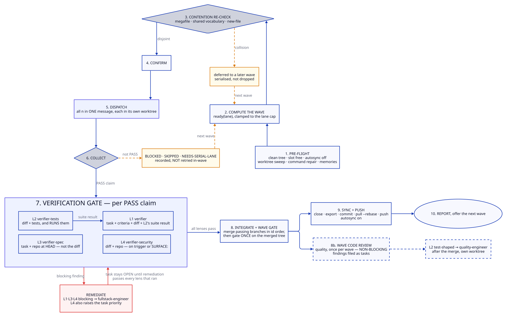

# The wave lifecycle

`/swarm` runs one wave: a set of independent tasks implemented in parallel, merged
serially, gated once. This page covers the ten steps, the three feedback paths, and what
blocks what — the detail that decides whether a wave lands or stalls.



## Inputs

| input | from | effect |
|---|---|---|
| ready set | `ready(lane)` | candidate tasks with no open blockers |
| lane cap | `harness.yaml` → `lanes[].concurrency` | clamps `n`; measured on your hardware |
| stack commands | `harness.yaml` + stack modules | what the gate and scoped tests run |
| security surface | `security.paths`, `security.tokens`, `security.invariants` | decides when L4 fires |
| `SURFACE:` line | the task, written by the planner | fires L4 **even when the diff greps clean** |

## 1. Pre-flight

Each condition fails the wave rather than degrading it.

```bash
harness/swarm/preflight.sh                   # ONE call, eleven steps: clean tree, config current (exit 3 = the
                                             #   plugin moved on since harness.yaml was reviewed — run
                                             #   /harness-setup), merge slot free, autosync off, ports, disk,
                                             #   worktree prune, the sweep (IN FLIGHT refs stop the run), its
                                             #   --apply, stack-command repair, record sizes
tk.sh memories                               # field-guide index for this wave's subject — content, not a gate
```

The first six were six calls, each re-reading the orchestrator's whole context — see
[cost](../concepts/cost.md) — and then four more the loop ran after them. Every write
(`autosync off`, `prune`, the sweep's `--apply`, the repair) is skipped when a gate before
it failed, so a failed pre-flight leaves the tracker, the worktrees and the config as it
found them. The sweep's in-flight count is a gate: committed work for an open task that no
worktree holds is adopted before that task is dispatched again, or the run does not start.

`git worktree prune` only forgets worktrees whose **directory is already gone**, so it does
nothing about the ones that actually accumulate — one per dispatched worker. The sweep is
what reclaims those.

`autosync off` stops the tracker staging its export into whatever commit comes next, which
would be a sibling worker's. Skipping it leaves the primary checkout dirty and fails the
*next* wave's clean-tree check.

## 2. Compute the wave

`ready(lane)`, clamped to the lane's concurrency cap. Caps live in config rather than a
prompt because a prompt cannot know your hardware.

## 3. Contention re-check

The planner already avoided file collisions. This is the last line of defence before
dispatch, and it catches what a path sweep structurally cannot.

| check | catches |
|---|---|
| **megafile** | any candidate path past `signals.megafile_lines` — two tasks in one huge file collide even when their functions differ |
| **shared vocabulary** | the same new field, error code, decision-record number, component or schema named in two descriptions |
| **new-file** | two tasks that will each *create* a file neither currently touches — a test-data factory, a shared fixture, a new services-layer module |

The new-file check is the one worth understanding: a path grep compares files that exist.
Two tasks both "needing a helper" produce the same new module and collide at merge, having
passed every path-based check.

**A collision defers a task to a later wave. It is serialised, not dropped.**

## 4–5. Confirm and dispatch

Every writer's task is asked `resume-point.sh <id>` first: a run that was stopped mid-wave
left branches, and MERGE, VERIFY and REATTACH need no new dispatch — REATTACH gets
`dispatch.sh --resume <branch>`, which adopts the existing worktree. Then all `n` are
dispatched **in a single message**, each in its own worktree, each through `dispatch.sh`
with `--digest` so the report's head and file path come back rather than the whole
report. One message because sequential dispatch serialises the wave by accident;
`dispatch.sh` because that is where the tier, the ceiling, the sandbox and the cost
record live — a hook refuses the Agent tool for the plugin's agents.

## 6. Collect

```
PASS              -> the verification gate
BLOCKED           -> recorded
SKIPPED           -> recorded
NEEDS-SERIAL-LANE -> recorded
```

**None of these are retried in-wave.** A worker that could not proceed is a signal about the
task or the environment, and re-running it inside the same wave usually reproduces the same
failure while spending another dispatch.

## 7. Verification gate

L1–L3 dispatch in parallel per `PASS` claim; L4 joins when its trigger fires.

| lens | sees | owns |
|---|---|---|
| L2 `verifier-tests` | the diff + tests, **and runs them** | adversarial vs decorative tests, what was skipped |
| L1 `verifier` | task + criteria + the diff + **L2's suite result** | correctness: every criterion met |
| L3 `verifier-spec` | task + **repo at HEAD** — not the diff, not the worker's report | docs, specs, ADRs, callers, blast radius |
| L4 `verifier-security` | the diff + the repo | what the wrong person can now reach |

L1 consumes L2's suite result, so the two are ordered rather than independent. L3's
exclusion from the diff is what makes agreement between L1 and L3 meaningful — see
[verification](../concepts/verification.md).

**L4 fires on the task's `SURFACE:` line whatever the diff shows.** If the planner recorded
that the task touches authorization, data exposure or a declared privacy invariant, L4 runs
even when the path grep returns nothing. This is the half that previously depended on the
orchestrator noticing.

### Remediation

| finding | routed to | timing |
|---|---|---|
| L1 / L3 `blocking` | `fullstack-engineer`, with the finding list | immediately |
| L4 `blocking` | `fullstack-engineer`, **and the task's priority is raised to match severity** | immediately |
| L2 test-shaped | `quality-engineer`, in its own worktree | after step 8 merges the branch |
| non-blocking | filed as tasks | before the push |

**The task stays open until the remediation itself passes every lens that ran.** A
`critical` security finding on a P3 task means the task was mis-priced, not that the finding
is minor.

## 8. Integrate and gate

Inside one `slot-acquire` / `slot-release`, merge each passing branch in ascending task
order, then run the gate **once** on the merged result against the **default** `DB_NAME`.

Per-branch gating is weaker, not stronger: an interaction defect between two workers'
changes is invisible to each branch's own gate, and the merged tree is what ships. A
command the stack does not declare is reported `--`, never silently skipped.

## 8b. Wave-stage code review

Quality review of the merged result, once per wave, **non-blocking**. Findings become task
records. A reviewer that can block stalls waves on taste; one that cannot block gets
ignored — so this one files, and severity routing sends anything genuinely blocking to L1
or L4 instead.

## 9. Sync and push

```bash
harness/swarm/close-wave.sh <id>="<what shipped, how verified>" <id>="…" --restore-autosync
```

One call: each close, ascending by id; `tk.sh export`; the epic view regenerated for every
epic the tasks belong to; `git add` of the export and the views; the commit;
`git pull --rebase --autostash`; the push; `git status -sb` up to date; and — only with
`--restore-autosync`, which a standalone `/swarm` passes and a wave inside `/campaign` does
not — `tk.sh autosync on`. If the rebase pulled in another actor's commits it stops before
the push and lists what remains, so the wave gate is re-run on the rebased tree first.

Once per wave, never per worker. Eight workers exporting produces eight conflicting
versions of one file. When the wave closes an **epic**, `close-epic.sh <epic> --reason …`
is the same tail with the epic's gates — children, fold-in, blocking prose, the decision
register, the retired staging folder — and the render-then-archive in front of it; nothing
is written if a gate fails. `/grind` closes one task at a time with the same call and
`--message "chore(tasks): close <id>"`.

## 10. Report

Then offer the next wave. Tasks recorded at step 6 and deferred at step 3 re-enter at
step 2.

## What blocks what

| mechanism | blocks | cleared by |
|---|---|---|
| `decision` record + `tk.sh park` (the gate and the status, one verb) | the **epic** | `/decision`, which ends with `tk.sh unpark` |
| `Permission:` record + dependency edge | **one task** | an operator answering; see [permissions](../concepts/permissions.md) |
| contention re-check | **one task, this wave** | the next wave |
| blocking lens finding | **one task**, kept open | remediation passing every lens that ran |
| merge slot | **integration**, across concurrent runs | `slot-release`, or a stale-lease steal that is logged |
