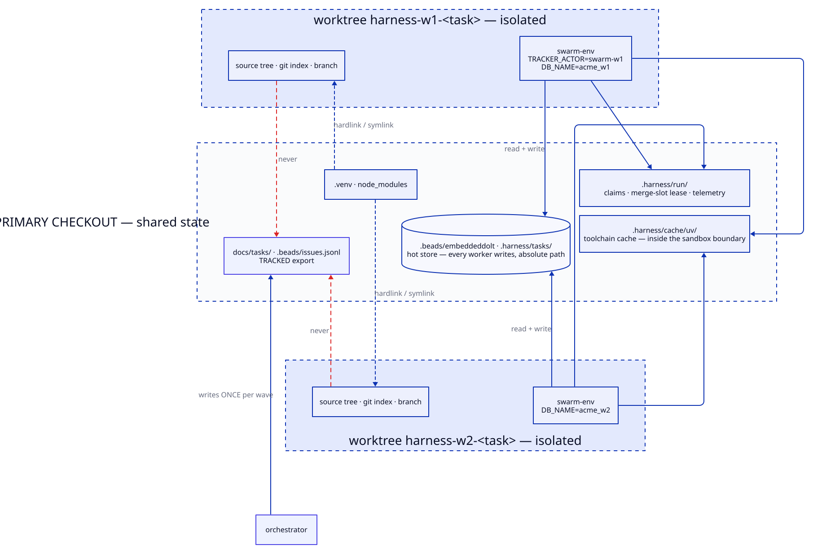

# Workers and state boundaries

A worker is one dispatch of a writer agent inside an isolated git worktree. Isolation is
what makes parallel waves safe — eight agents editing one tree would corrupt each other
within seconds — but complete isolation would make them useless, because the workers must
agree on which tasks are claimed and which are done.

So the model is isolation with three deliberate exceptions: the tracker store, the
coordination directory, and the toolchain cache are shared by absolute path. Everything
else is per-worker. Most failures in this area come from something crossing that line
unintentionally, which is why the table below is worth reading before changing anything
that writes to disk.

## Layout




## What is isolated, what is shared

| state | scope | writer |
|---|---|---|
| source tree, git index, branch | **per worker** | that worker |
| `.venv` / `node_modules` | hardlink/symlink to primary | nobody — read-only in effect |
| `DB_NAME` (test database) | **per worker** | that worker |
| tracker hot store | **shared**, absolute path | any worker |
| claims, merge-slot lease | **shared** | any worker, via `O_EXCL` |
| tracked tracker export | **shared** | **orchestrator only**, once per wave |
| telemetry series | **shared**, append-only | any dispatch |

Two rules follow from the last row and are enforced at wave boundaries:

1. A worker must not commit the tracked export. Eight workers committing it produces eight
   conflicting versions of one file.
2. `/swarm` sets `autosync off` at pre-flight and restores it at close-out. Otherwise the
   backend stages its export into whatever commit comes next — a sibling's — and the
   primary checkout ends the wave dirty, which fails the next wave's clean-tree gate.

## `.swarm-env`

Generated by `models/worker.py::env_block()`, a pure function of `harness.yaml` plus the
stack modules. Never hand-edited; regenerate by re-running the init.

```sh
# Generated by harness/models/worker.py from harness.yaml and harness/stacks/.
export TRACKER_ACTOR=swarm-w1          # backend-neutral identity used by claims
export BEADS_ACTOR=swarm-w1            # bd reads this name and nothing else
export BEADS_DB=/abs/primary/.beads/embeddeddolt    # ABSOLUTE -> shared store
export DB_NAME=acme_w1                 # from stacks[].env, {slug}_w{worker}
export SWARM_SLOT=ACME-merge-slot
export SWARM_LANE=backend
```

**Do not `source` it.** Two independent reasons:

- Every Bash call is a fresh shell, so the exports do not reach the next command.
- `source` evaluates its argument as shell code and matches no permission rule, so the
  call is refused.

`verify/run.sh` loads it via `commands.py::_worker_env()` — a five-line parser, not a
shell — and that is the sanctioned path. It looks for it at the root of the checkout the
caller stands in (`CHECKOUT`), which is the worker's worktree; it once looked in the
project (`REPO`), so a worker's suite ran against the primary's code and the shared
database, green with the worker's own change broken. Every command's whole output is kept
at `.harness/run/out/<stack>-<key>.log` in that checkout, and the report carries a digest
and the path.

## Lifecycle

Worktrees are created on demand by `dispatch()` when the agent declares
`isolation: worktree`, and reclaimed after the wave. A fresh dispatch never inherits one
silently — a leftover from a failed wave carries a stale branch and a stale `.swarm-env`,
so `dispatch()` refuses and names the sweep. But a run that was *stopped* leaves work worth
adopting, and that is a decision the harness makes explicit rather than defaulting either
way: `resume-point.sh <task>` reads the branch, the worktree and the task's notes and
answers **MERGE** (committed, verified — merge it), **VERIFY** (committed, not yet judged),
**REATTACH** (uncommitted edits in the worktree — `dispatch.sh --resume <branch>` adopts
them) or **FRESH**. Nothing ahead of main is always FRESH; a false "landed" once closed work
nobody had done. `/halt` runs `preserve-worktrees.sh` first, so every worktree's diff and
unmerged commits are copied under `.harness/halted-<date>/` before anything is removed.

```bash
# created by dispatch when the agent declares isolation: worktree
harness/swarm/swarm-worktree-init.sh <n> <lane>
  # git worktree add .claude/worktrees/harness-w<n>-<task>
  # hardlink .venv / symlink node_modules from the primary checkout
  # write .swarm-env

# reclaimed after the wave
harness/swarm/worktree-sweep.sh            # report
harness/swarm/worktree-sweep.sh --apply    # remove
```

**Edge cases**

| case | behaviour |
|---|---|
| worktree path already exists | `DispatchError` naming the sweep command — never silent reuse; `--resume <branch>` is the explicit adoption |
| agent declares `isolation: worktree`, cwd is the primary checkout | refused; a wave that proceeds corrupts the main tree |
| worker stopped mid-task (budget, crash) | partial edits remain, uncommitted and isolated. The sweep reports them rather than discarding; `resume-point.sh` says REATTACH; `preserve-worktrees.sh` copies them out before a release |
| a branch or worktree with no live task — the residue of a killed run | the sweep's second pass lists it as an orphan ref; `--prune-orphans` removes what carries no unmerged commit |
| default branch is not `main` | detected via `origin/HEAD`, then `main`/`master`/`trunk`, then error |

## Concurrency primitives

Claims and the merge slot are implemented once in `tracker/locks.py` rather than per
backend. That is a deliberate consequence of the deployment model: every worker runs on one
machine against one filesystem, so coordination is a POSIX problem rather than a
distributed-consensus one, and the storage backend has nothing to do with it.

`tracker/locks.py`, one implementation serving every backend — claims coordinate *this
machine's processes*, which is true regardless of where records are stored.

| operation | primitive | on contention |
|---|---|---|
| claim a task | `O_EXCL` create, then `os.link` | loser reads the holder, returns *already claimed by X* |
| same actor re-claims | — | succeeds (idempotent re-dispatch after `/halt`) |
| merge slot | lease file + holder pid + liveness probe | dead holder's lease is stolen **and logged** |
| record write | write temp + `os.replace` | readers never see a half-written file |

**These coordinate ONE machine's processes.** Two campaigns on two machines share none of
this — `.harness/run/` is local to a checkout — so both could claim the same task and both
merge. That gap is covered separately by an
[epic lease on a git ref](tracker-ports.md#cross-machine-coordination), at epic rather than
task granularity:

```bash
tk.sh lease acquire <epic>   # exit 1 if another machine holds it
tk.sh lease release <epic>
```

The normal path is uncontended: the orchestrator assigns a specific task id and the worker
is told never to pick a different one. The claim is a guard against orchestrator error —
double dispatch, or a stale re-dispatch after `/halt` — not an allocator.
